# Oja B2B Client Pitch & Sourcing Guide
**"From Farm to Family, Verified & Fresh"**

This guide is designed to assist you in pitching the Oja platform ecosystem (including the Customer Mobile App, Farmers Dashboard, and Admin/Management Dashboard) to B2B clients (restaurants, hotel chains, supermarkets, and corporate canteens).

---

## 1. The Oja Elevator Pitch

> **"Oja is the first end-to-end farm-to-table marketplace in Nigeria that combines AI-driven supply chain automation with blockchain-verified food traceability. We solve the three biggest problems in agricultural procurement: safety, spoilage, and sourcing opacity. With Oja, every tomato, yam, and pepper is verified from seed to plate—delivering farm-fresh ingredients in under 8 hours with zero middlemen."**

---

## 2. Core Value Propositions (The Three Pillars)

### 🌾 Pillar 1: 100% Immutable Food Traceability
Modern buyers care deeply about food origin, chemical residues, and safety. Oja provides immediate proof of quality:
* **Blockchain Sourcing ID**: Every batch has a unique, immutable tracker (e.g., `#OJ-PEPP-7023`) tying it back to a specific licensed grower.
* **Lab-Grade Inspections**: Real-time access to pesticide levels (e.g., `0.00 ppm Organic PASS`), soil pH, organic matter rating, and water sources (e.g., Plateau mountain spring water).
* **Transparent Standards**: Standardizes GAP (Good Agricultural Practices) compliance for smallholder farms.

### ⏱️ Pillar 2: The Near Zero-Lag Freshness Chain
In conventional supply chains, produce sits in open-air trucks or middleman stalls for days, losing up to 40% of nutritional value and shelf life.
* **Harvest-Hour Matching**: Products are matched and loaded onto temperature-regulated transport within hours of harvest (e.g., harvested at *05:30 AM in Jos*, sorted and sanitised by *08:30 AM*, delivered to *Lagos by 02:00 PM*).
* **Active Cold Chain Logs**: Integrates transit temperature checks. Logistics anomalies trigger direct dashboard notifications, ensuring clients never receive bruised or overheated stock.

### 🤖 Pillar 3: AI-Assisted Sourcing & Waste Prevention
* **Recipe-Based Sourcing (AI Order Wizard)**: B2B clients or consumers don’t just order items; they plan menus (e.g., Jollof Rice, Edikang Ikong, Asaro). The AI Order Wizard automatically calculates the exact quantities needed, cross-checks what ingredients are already in their inventory, and generates an optimized purchase basket.
* **Demand Matching**: Farmers list exactly what they are harvesting, and the platform aggregates this with active B2B orders to guarantee purchase before the crop leaves the soil.

---

## 3. The Oja Ecosystem Architecture

The Oja platform operates as a cohesive triple-app network connecting the farmer, the hub manager, and the client.

```mermaid
graph TD
    %% Roles
    Farmer[Partner Farmer] -->|Uploads Batches & Lab Certificates| FarmersDB[Farmers Dashboard]
    Admin[Oja Admin/Hub Operations] -->|Dispatches Courier & Quality Checks| AdminDB[Admin Dashboard]
    Client[B2B Client / Consumer] -->|Orders via Recipe Wizard / Browse| Mobile[Mobile App]

    %% Data Flow
    FarmersDB -->|Stock & Logistics Logs| AdminDB
    AdminDB -->|Oja Certified Badging & Courier Dispatch| Mobile
    Mobile -->|Direct Payout Ledger| FarmersDB
    
    %% Value Outputs
    style Farmer fill:#E8E8E3,stroke:#0B3014,stroke-width:2px
    style Admin fill:#FF4D00,stroke:#0B3014,stroke-width:2px
    style Client fill:#0B3014,stroke:#0B3014,stroke-width:2px
```

---

## 4. Client-Specific Pitch Strategies

Different clients have distinct pain points. Adapt your pitch using the matrix below:

| Client Type | Core Pain Point | Key Oja Feature to Emphasize | High-Impact Pitch Hook |
| :--- | :--- | :--- | :--- |
| **High-End Restaurants & Hotels (HoReCa)** | Inconsistent ingredient quality, unpredictable supply, lack of organic verification. | **Lab Certificates & Traceability Cards** | *"Your chefs can verify the exact harvest time, soil conditions, and organic purity of every single basket before it enters your kitchen."* |
| **Supermarket & Grocery Chains** | High wastage rates (shrinkage), short shelf life, logistics delays. | **Freshness Timeline & Cold Chain Logs** | *"Extend your retail shelf life by 3 to 5 days. We move produce from the Jos Plateau highlands directly to your shelves in Lagos in under 8 hours."* |
| **Corporate Canteens / Institutional Catering** | High procurement overheads, food waste from over-ordering bulk items. | **AI Recipe Order Wizard** | *"Stop over-buying raw vegetables. Input your weekly menu into our Order Wizard, and we'll cross-reference your current inventory to supply only the exact weight needed."* |
| **Social Impact Investors / CSR Partners** | Low farmer income, high post-harvest losses in rural regions. | **Farmer Dashboard & Financial Ledger** | *"We cut out middleman exploitation. Through the Farmers Dashboard, smallholders receive instant direct-deposit payouts and subsidy credits."* |

---

## 5. Slide-by-Slide Pitch Deck Outline

Use this template to build your presentation deck:

### Slide 1: The Cover
* **Title**: Oja: Sourcing Reimagined.
* **Subtitle**: Farm-to-Table Freshness, Blockchain Sourcing, and AI-Powered Logistics.
* **Visual**: Clean, premium image of fresh, organic ingredients.

### Slide 2: The Sourcing Dilemma (The Problem)
* **The Reality**: Food decays quickly in standard transit. Sub-Saharan Africa loses up to 40% of fresh food post-harvest.
* **The Trust Gap**: Buyers don’t know where their food was grown, what chemicals were used, or if it was washed with clean water.
* **The Price Hikes**: Up to 4 middlemen mark up prices before produce reaches urban consumers.

### Slide 3: The Oja Sourcing Engine (The Solution)
* Explain the integrated platform:
  * **1. Verification**: Soil and water analysis directly on the blockchain.
  * **2. Sourcing**: Direct-from-farm cold-chain logistics.
  * **3. Intelligence**: AI wizard to prevent food waste.

### Slide 4: Interactive Code-to-Product Demonstration
*(Show screens from the app. Highlight the live demo elements in Section 6 below.)*

### Slide 5: Economic & Operational Model
* **Fair Price Guarantee**: Disintermediating brokers saves clients 15-20% on premium produce while paying farmers 30% more.
* **Consistent Quality**: Oja Certified standards act as a quality filter (firmness, blemish ratio < 1%).
* **Reliability**: Decentralized farmer network ensures backup supply during crop season shifts.

### Slide 6: Sourcing Footprint & Social Impact
* **Highlighting Partners**: Supporting farms in Jos Highlands, Kano Plains, and Abakaliki Agro Hubs.
* **Carbon Reduction**: Reduced transit times mean fewer emissions and fewer truck miles.
* **Financial Inclusion**: Direct mobile ledger payouts and seed subsidies.

---

## 6. Live Product Demo Guide

When presenting to a client, walk them through the active features of the app to show how robust the technology is.

### Demo Flow 1: Sourcing Traceability (Visual Verification)
1. **Open the Product Detail** on the Customer App.
2. Highlight the **"Oja Certified"** badge.
3. Show the **Traceability Card** ([TraceabilityCard.tsx](file:///Users/fehintolu/Desktop/Oja/packages/shared/src/components/TraceabilityCard.tsx)):
   * **The Farmer**: Click to see Farmer Segun Alao (Jos Highlands Partner Farm, Plateau State). Read his quote about cold storage support.
   * **Soil & Water**: Point out the **Organic Matter (94%)**, **Pesticides (0.00 ppm)**, **Soil pH (6.8)**, and spring water source.
   * **Compliance**: Show the Good Agricultural Practice (GAP) digital certificate number `OJ-L-49221`.
4. **Why this wins**: It builds immediate corporate trust and fulfills regulatory audits.

### Demo Flow 2: Live Freshness Timeline
1. Open the active tracking interface.
2. Show the **Oja Certified Path** ([FreshnessTimeline.tsx](file:///Users/fehintolu/Desktop/Oja/packages/shared/src/components/FreshnessTimeline.tsx)):
   * **05:30 AM**: Field Harvested in Jos.
   * **07:15 AM**: QA Checked (structural firmness and pesticide residue checks).
   * **08:30 AM**: Sanitized & Packaged in oxygen-permeable liners.
   * **09:45 AM**: In transit via temperature-controlled trucks.
   * **02:00 PM**: Dispatched by the last-mile courier.
3. **Why this wins**: It proves that the client is getting items harvested *that morning*, not sitting in warehouses for days.

### Demo Flow 3: AI Order Wizard (Preventing Kitchen Waste)
1. Choose a recipe in the app (e.g., **Classic Jollof Rice** or **Edikang Ikong**).
2. Start the **Order Wizard** (built within [MobileApp.tsx](file:///Users/fehintolu/Desktop/Oja/apps/mobile/src/MobileApp.tsx)):
   * Select what ingredients you *already have* in the kitchen (e.g., "I already have Ginger and Scotch Bonnet").
   * Enter the number of servings needed.
   * The AI calculates exactly what raw products to add (e.g., Vine-Ripened Tomatoes, Mixed Bell Peppers, and Purple Nigerian Onions) and leaves out the rest.
3. **Why this wins**: Institutional kitchens can reduce their raw waste by up to 25% by preventing over-purchasing.

---

## 7. Objection Handling & FAQ

> [!IMPORTANT]
> Keep your answers concise, data-driven, and focused on risk-mitigation.

### Q1: "How do you guarantee deliveries arrive fresh, especially with Nigerian traffic and infrastructure?"
* **Answer**: Oja controls the logistics chain. We package produce in specialized oxygen-permeable, biodegradable breathable liners and transport them in trucks equipped with temperature sensors. Our Admin Dashboard has real-time temperature tracking; if a truck goes above optimal storage temperature, our system triggers an automatic logistics reroute or alerts the receiving team.

### Q2: "Are Oja Certified products significantly more expensive than open market prices?"
* **Answer**: No. By removing multiple tiers of middlemen and buying direct, we absorb the cost of safety testing and high-quality logistics. Our B2B contract prices are highly competitive with open markets, but with the added benefits of predictability, compliance documentation, and 0% spoilage on arrival.

### Q3: "How do you verify the soil and pesticide lab reports?"
* **Answer**: Our Agronomy Lab runs regular sample checks for every farm partner. Each harvest batch requires a digital log upload from our field agents. These logs are stored securely with immutable batch IDs. If a batch fails the threshold (above 0.01 ppm pesticide), the app automatically restricts the partner from listing that harvest.

---

> [!TIP]
> Keep a sample Oja QR code or app build ready on your phone when pitching. Showing the actual **Traceability Card** live is the single most convincing moment of the pitch!
