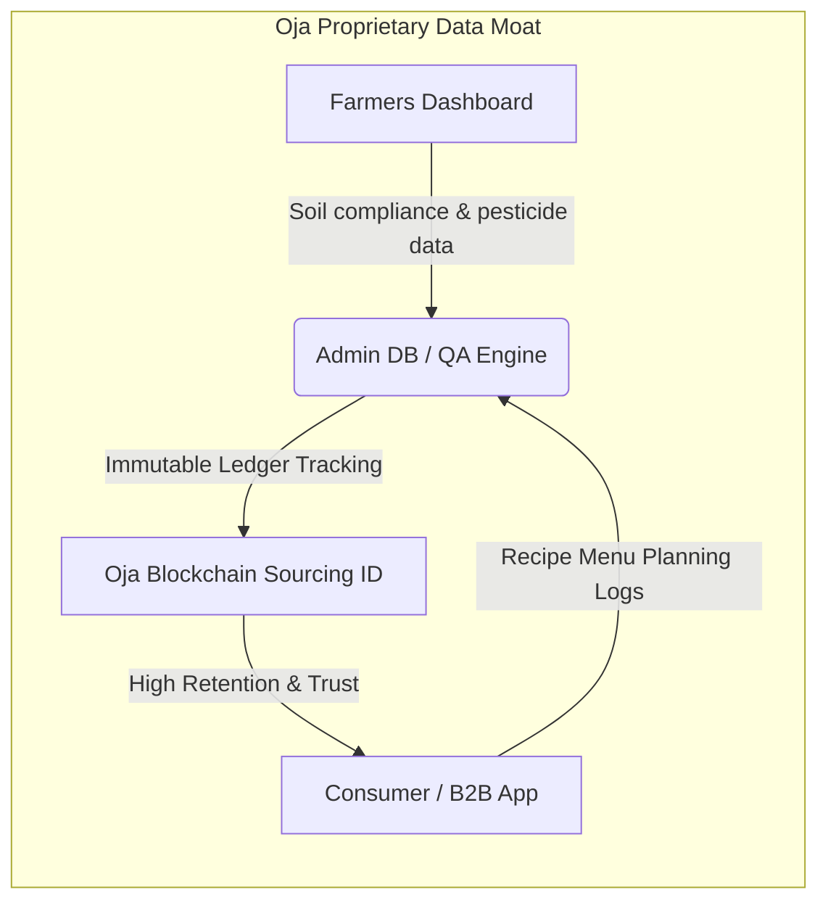

# Oja Investor Pitch & Business Guide
**"Scaling Africa's Trust-Backed Agricultural Supply Chain"**

This guide is structured to help you pitch Oja to venture capital firms, impact investors, and angel syndicates. It details Oja's market opportunity, economic viability, defensibility, unit economics, and slide-by-slide investor deck structure.

---

## 1. The Investor Elevator Pitch

> **"Oja is an integrated agritech marketplace transforming Africa's fragmented agricultural supply chain. By linking smallholder farmers directly to high-yield urban B2B buyers through a unified triple-app ecosystem, we eliminate the 3 to 4 layers of middlemen brokers that cause up to 40% post-harvest spoilage and inflate food costs. Powered by blockchain-backed quality auditing (pesticide/soil verification) and AI-driven recipe-level demand forecasting, Oja secures stable supplier pricing, delivers maximum shelf life to retailers, and unlocks premium B2B commissions."**

---

## 2. The Market Opportunity (TAM / SAM / SOM)

### 📈 The Macro Landscape
* **Food Inflation & Inefficiency**: Food spending represents over 50-60% of household income in major African cities like Lagos, Accra, and Nairobi. However, supply chain inefficiencies drive up costs artificially.
* **The Post-Harvest Waste Crisis**: Over **$4B worth of fresh produce** goes to waste annually in Nigeria alone due to poor logistics, lack of cold chain infrastructure, and delayed sales.
* **Rapid Urbanization**: Urban population growth is shifting food retail toward structured grocery chains, cloud kitchens, and institutional caterers who require consistent, safe, and audited inputs.

### 📊 Addressable Market Breakdown
* **Total Addressable Market (TAM)**: $40 Billion – The total fresh produce market size in Nigeria across retail and wholesale.
* **Serviceable Addressable Market (SAM)**: $6 Billion – The commercial and retail fresh food procurement sector in Tier 1 and Tier 2 cities (Lagos, Abuja, Port Harcourt).
* **Serviceable Obtainable Market (SOM)**: $150 Million – Capturing 2.5% of the commercial fresh food market by targeting mid-to-large HoReCa (Hotels, Restaurants, Caterers) and retail supermarket networks within 5 years.

---

## 3. Technology Defensibility & The Triple-App Moat

Investors look for a technological "moat" that prevents competitors from easily replicating the business. Oja's defensibility lies in its connected ecosystem data:

1. **Integrated Supply Chain Ledger**: Every harvest uploaded to the **[FarmersDashboard.tsx](file:///Users/fehintolu/Desktop/Oja/apps/farm-dashboard/src/FarmersDashboard.tsx)** generates an automated quality rating profile. This builds a proprietary risk-assessment dataset of farmers' yields, compliance history, and reliability.
2. **AI Demand Lock-In**: By providing B2B kitchens with the AI Order Wizard (**[MobileApp.tsx](file:///Users/fehintolu/Desktop/Oja/apps/mobile/src/MobileApp.tsx)**), Oja moves from a transactional checkout model to an *operating system for raw food procurement*. Once a kitchen's menu and pantry inventory are managed on Oja, switching costs become extremely high.
3. **Frictionless Logistics Routing**: The **[ManagementDashboard.tsx](file:///Users/fehintolu/Desktop/Oja/apps/admin-dashboard/src/ManagementDashboard.tsx)** tracks cold-chain telemetry. Real-time temperature checks verify that quality is preserved, which reduces customer returns to near 0%.

---

## 4. Monetization & Unit Economics

Oja generates high-margin transactional and services revenue:

* **Transaction Commissions (12-15%)**: Charged on the gross value of all produce sold through the platform. By cutting out 3 to 4 middle brokers (who markup up to 50-80%), Oja can lower client prices, pay farmers more, and capture a healthy margin.
* **Logistics & Dispatch Fees**: A fee structured into orders to cover regional and last-mile dispatch, managed dynamically on our platform.
* **Premium Subscriptions & Financing**: 
  * *B2B Clients*: Premium SLA agreements for guaranteed early-morning delivery slots.
  * *Farmers*: Access to high-grade fertilizer/seed financing, structured using transaction histories from the Oja Ledger.

### Sample Transaction Economics
| Metric | Value (NGN / ₦) | Explanation |
| :--- | :--- | :--- |
| **Gross Merchandise Value (GMV)** | ₦100,000 | Bulk tomato & pepper order from a restaurant |
| **Cost of Goods Sold (COGS)** | ₦75,000 | Direct payment to Plateau farmer (30% higher than local middleman rates) |
| **Gross Platform Margin** | ₦25,000 (25%) | Retained margin |
| **Logistics & Quality Auditing Cost** | ₦10,000 | Hub consolidation, lab audit, and temperature-controlled delivery |
| **Contribution Margin** | ₦15,000 (15%) | Net profit contribution per delivery |

---

## 5. ESG & Social Impact (Venture Capital & Impact Funds)

Oja addresses key United Nations Sustainable Development Goals (SDGs):
* **Goal 2: Zero Hunger & Agricultural Productivity**: Boosts smallholder farmer incomes by providing direct market access.
* **Goal 12: Responsible Consumption and Production**: Drastically reduces food waste in transit through rapid harvest-to-table routing (under 8 hours) and AI inventory tracking.
* **Goal 8: Decent Work and Economic Growth**: Transports rural farmers (e.g. *Jos Highlands Farms*) into the digital economy through formalized payout histories, enabling them to secure banking facilities.

---

## 6. Slide-by-Slide Investor Pitch Deck Outline

### Slide 1: Cover & Vision
* **Headline**: Oja: The Trust-Backed Agricultural Supply Chain.
* **Sub-headline**: Eliminating agricultural wastage and middleman markups across Africa using blockchain traceability and demand-side AI.

### Slide 2: The Core Problem
* **Bullet points**:
  * 40% post-harvest spoilage due to open-truck logistics.
  * 3-4 layers of middlemen brokers driving up food costs by 80%.
  * Complete opacity: B2B buyers have no food safety verification (high chemical residues).

### Slide 3: The Solution
* **Bullet points**:
  * **Oja Traceability**: Blockchain Sourcing IDs proving soil organic purity and pesticide compliance.
  * **Direct Cold Chain**: From Plateau farms to Lagos hubs in under 8 hours.
  * **AI Procurement**: Order Wizard matching recipe requirements with live farm yields.

### Slide 4: Market Size (TAM / SAM / SOM)
* Visual: Nested circles representing the $40B TAM (Nigeria produce), $6B SAM (urban wholesale food sector), and $150M SOM (target B2B market).

### Slide 5: The Technology Ecosystem
* Showcase the integration:
  * **Farmer**: **[FarmersDashboard.tsx](file:///Users/fehintolu/Desktop/Oja/apps/farm-dashboard/src/FarmersDashboard.tsx)** (listings, compliance, transaction history).
  * **Operations**: **[ManagementDashboard.tsx](file:///Users/fehintolu/Desktop/Oja/apps/admin-dashboard/src/ManagementDashboard.tsx)** (logistics monitoring, quality badges, audit approvals).
  * **Buyer**: **[MobileApp.tsx](file:///Users/fehintolu/Desktop/Oja/apps/mobile/src/MobileApp.tsx)** (menu tracking, traceability, purchasing).

### Slide 6: Business Model & Traction
* Explain transaction fee commission structure, recurring B2B retention rates, and active cohort growth (e.g. *Jos Highlands Farms*, *Kano Plains Grains*, *Ijebu Cassava & Fruits*).

### Slide 7: Go-To-Market (GTM)
* Focus on institutional kitchens first:
  * Land corporate canteen providers and restaurant groups (HoReCa) to secure large, predictable volume.
  * Use the AI Order Wizard to drive organic referrals between chefs.

### Slide 8: The Ask & Financial Milestones
* **The Ask**: [Specify Round Size, e.g., $1.5M Seed Round]
* **Use of Funds**:
  * 45%: Expanding cold-chain micro-hubs in Lagos and Abuja.
  * 30%: Enhancing logistics routing AI & blockchain auditing.
  * 25%: Key business development and onboarding new farm clusters.
* **Milestones**: Scaled to 500+ B2B buyers, 12,000 tons of fresh food routed, and carbon footprint reduction of 35% within 18 months.
